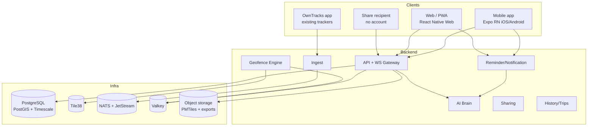
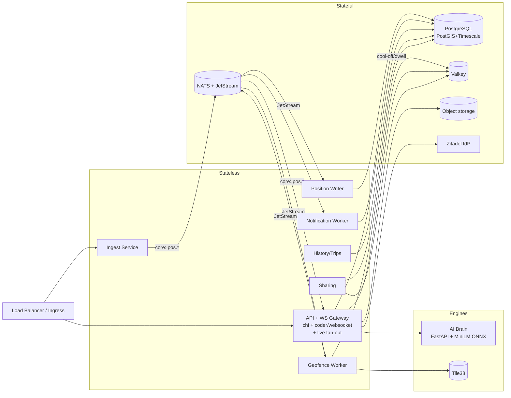
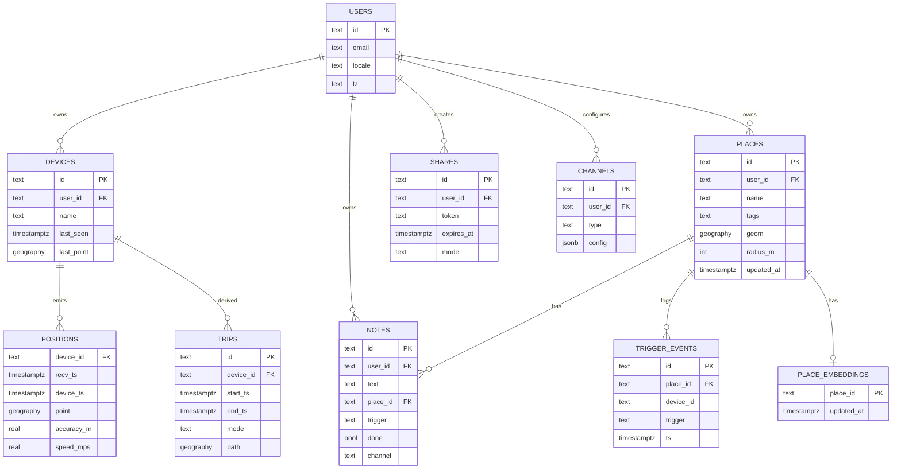
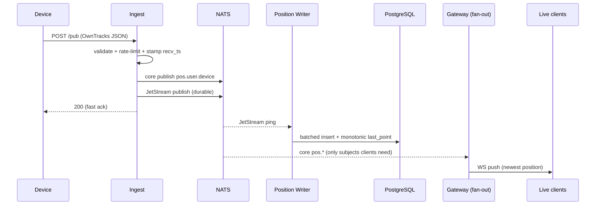
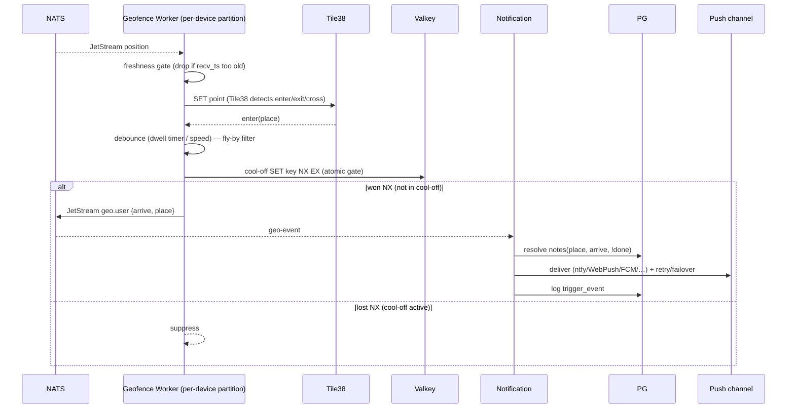
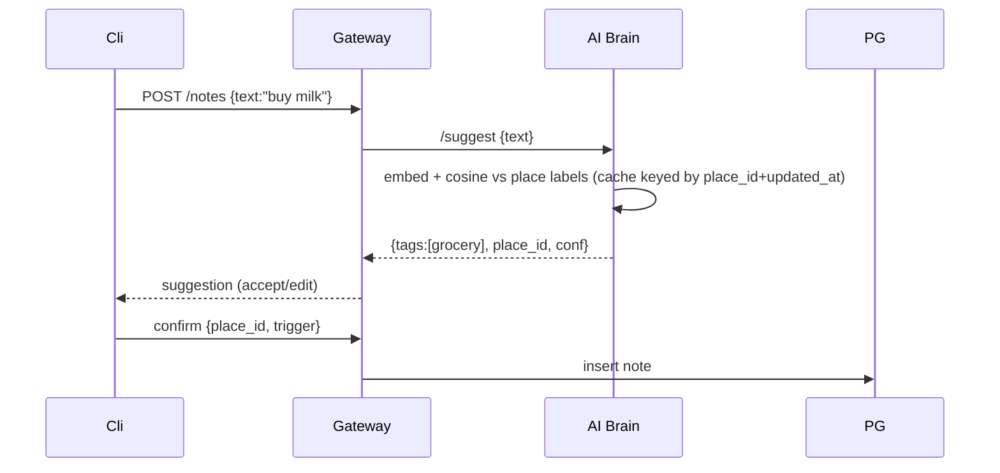
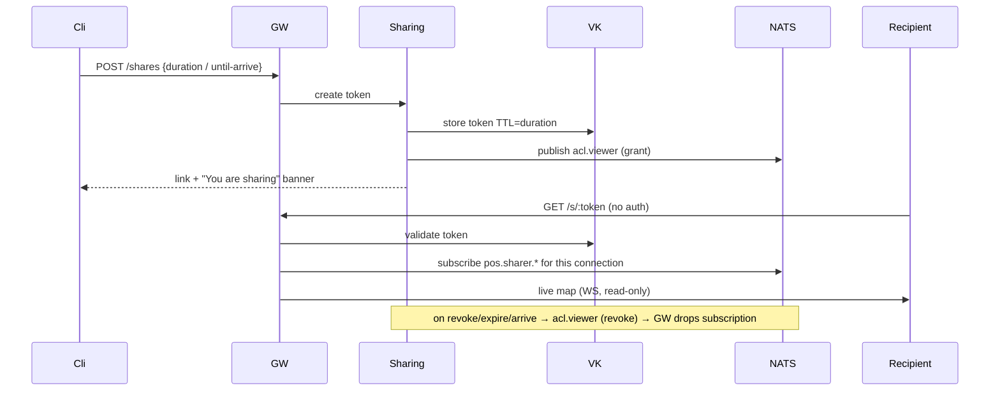
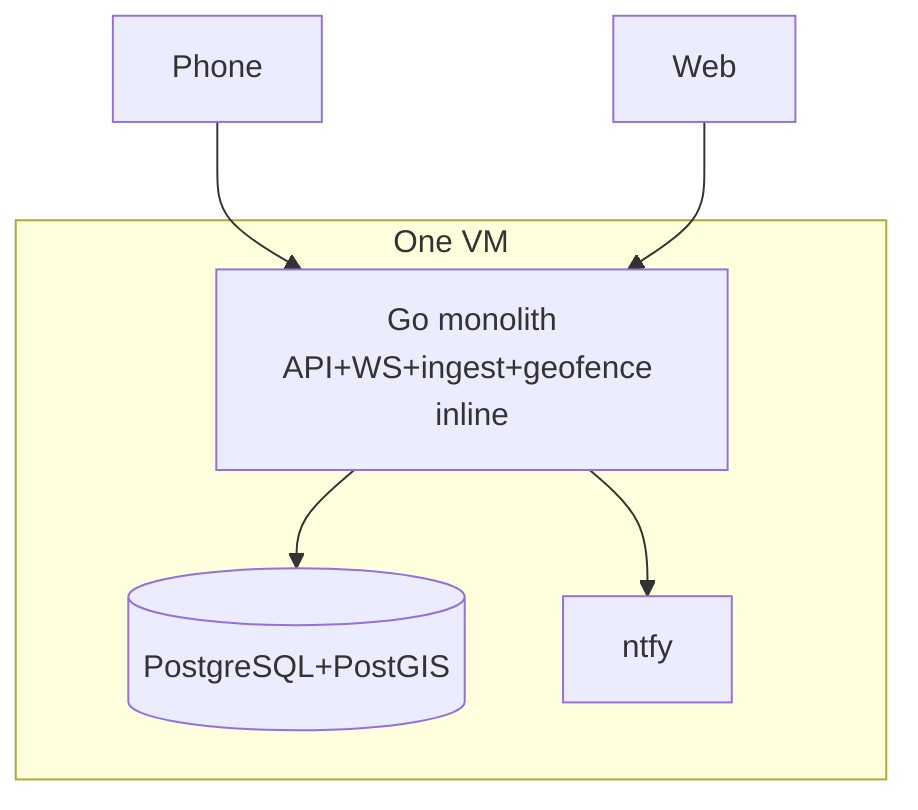
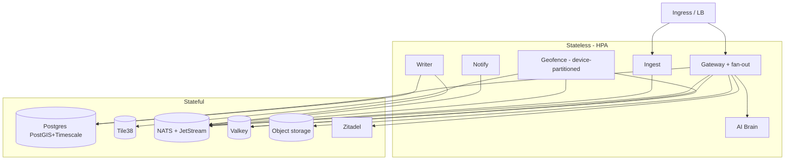

# Lura — High-Level Design (HLD)

**Version:** 1.1 · **Status:** Draft · **Scope:** End-to-end system design for Lura (private, AI-native location companion).

> **Changelog v1.0 → v1.1 (correctness pass):** fixed geofence-worker concurrency race (per-device partitioning + atomic cool-off gate); clarified that Tile38 owns enter/exit state and the worker only adds debounce + cool-off; made dwell timer-based and durable; added a **freshness gate** so stale/replayed pings don't fire reminders; made `last_point` upsert **monotonic**; strengthened the **idempotency key** beyond 1-second resolution; **folded fan-out into the Gateway** (each replica subscribes to NATS directly); split **core NATS** (live fan-out) from **JetStream** (durable consumers); specified the **pass-by/route-corridor** mechanism and flagged it as a design hole; added **share-driven re-subscription** and **place-embedding cache invalidation**; clarified the geofence-latency NFR; fixed the ER diagram syntax.

This HLD describes the **target (scaled) architecture** as the source of truth, and explicitly flags where **Phase 1 (the 2-day MVP)** collapses or stubs a component. Everything is open source.

---

## 1. Overview & scope

Lura tracks devices live, lets users draw places (geofences) and attach notes, fires place/route-based reminders, supports safe expiring location sharing, and keeps a private history — all self-hostable so user data never leaves their infrastructure. Frontend is one Expo (React Native + Web) codebase for web/iOS/Android. Backend is Go.

**Audience split that drives design:** ~65% mobile (iOS/Android), ~35% web. Both are first-class surfaces; web is the full control center, mobile adds always-on background tracking.

---

## 2. Requirements

### 2.1 Functional
- Ingest device location (HTTP + MQTT/OwnTracks), store, and stream live to authorized clients.
- Create/manage geofences (circle in MVP, polygon later) with tags.
- Attach notes to places; AI suggests the right place/tag from free text.
- Evaluate arrive / leave / pass-by / dwell triggers with fly-by filtering and cool-off.
- Deliver reminders over multiple push channels (incl. without Google services).
- Create expiring, revocable share links (no account needed to view).
- Private history: trips/stops, search, export (GeoJSON/GPX), delete/retention.
- Multi-user accounts + mutual-consent group sharing.

### 2.2 Non-functional (targets)
| NFR | Target |
|---|---|
| Ingest write path latency (p99) | < 50 ms server-side ack |
| Live position fan-out (p99) | < 250 ms ingest→client |
| Geofence trigger detection (p95) | < 2 s **from the confirming (qualifying) ping** — see note |
| Map tile / API read (p95) | < 200 ms |
| Availability | 99.9% (single-region, multi-replica) |
| Horizontal scalability | stateless API + workers scale by replica count |
| Privacy | no user location/notes leave the operator's infra by default |
| Global reach | usable on Android Go-class over 2G/3G, offline-tolerant |

> **Note on the geofence NFR:** "arrive" deliberately waits for slowing/stopping (fly-by filter), so wall-clock time from *first* zone entry to reminder can exceed 2 s by design. The < 2 s budget is measured from the **confirming** ping (the one that satisfies the debounce condition) to delivery, not from first entry. State this to avoid a false contradiction.

---

## 3. System context

---

## 4. Architecture overview

Lura is a set of **stateless Go services** communicating over **NATS** (core NATS for the live path, **JetStream** for durable work), backed by **PostgreSQL (PostGIS + TimescaleDB)** for durable state, **Tile38** for the real-time geofence hot path, and **Valkey** for shared ephemeral state. The frontend is a single Expo codebase.

**Why this shape:** ingest does the minimum (validate → publish → ack); all heavy work (persist, fan-out, geofence, notify) happens asynchronously off NATS. Each box scales independently, keeping p99 ingest latency low.

**Core NATS vs JetStream (important):**
- **Live position fan-out → core NATS** (at-most-once, fire-and-forget). Dropping one position is harmless — a fresher one arrives in ~20 s — and we avoid JetStream's persistence latency on the live path.
- **Position Writer + Geofence Worker + Notification → JetStream** (at-least-once, durable, replayable). Here we must not lose a ping that triggers a reminder or a row that belongs in history.

---

## 5. Component design

### 5.1 API + WebSocket Gateway (Go, chi + coder/websocket) — also does live fan-out
- Terminates REST (CRUD for places/notes/devices/shares/history) and WebSocket (live map).
- AuthN via JWT (Zitadel in Phase 2; static bearer in Phase 1).
- **Fan-out is folded into the Gateway** (corrects v1.0's separate Fan-out service). Each Gateway replica directly subscribes (core NATS) to exactly the subjects its currently-connected clients are authorized to see, and pushes updates to those local WebSocket connections. No internal hop between a "fan-out service" and the socket owner.
- **Authorization & re-subscription:** a client viewing its own devices subscribes to `pos.<self>.*`. For group sharing it also subscribes to `pos.<other>.*`. When a share is **granted or revoked**, the Sharing service publishes a control event (`acl.<viewer>`) that the Gateway consumes to add/drop the relevant subscription for that live connection. Subscriptions are re-evaluated on connect and on every ACL change — never cached past a revoke.
- Backpressure: bounded per-connection send buffer, **drop-to-latest** (live map only needs the newest point).
- **Phase 1:** Gateway is the whole monolith (ingest + in-process hub + geofence inline).

### 5.2 Ingest Service
- Accepts `POST /pub` (OwnTracks JSON) and (Phase 2) MQTT via EMQX→NATS bridge.
- Validates payload, rate-limits per device, stamps a high-resolution **server-receive timestamp** `recv_ts`.
- Publishes to subject `pos.<user>.<device>` on **core NATS** (live path) and to a **JetStream** stream (durable path for writer + geofence). Returns 200 immediately.
- **Idempotency (fixed):** the dedupe/PK key is **`(device_id, recv_ts_micros)`** plus an optional client sequence number — *not* OwnTracks `tst` (epoch **seconds**), which collides for two genuine pings in the same second. `tst` is retained as a data field, not the key.

### 5.3 Position Writer (JetStream consumer)
- Batches inserts into the `positions` TimescaleDB hypertable.
- **Monotonic last-position (fixed):** updates `devices.last_point/last_seen` with a guard so a late/out-of-order ping (from offline replay) cannot overwrite a newer fix:
  `UPDATE devices SET last_point=$p, last_seen=$ts WHERE id=$d AND ($ts > last_seen OR last_seen IS NULL)`.
- **Phase 1:** synchronous insert inside the ingest handler (still applies the monotonic guard).

### 5.4 Geofence Worker (JetStream consumer) + Tile38

**Partitioning (fixes the concurrency race):** the JetStream consumer is **partitioned by `device_id`** (subject token or partitioned consumer), so **all pings for one device are processed by exactly one worker in order**. This removes the multi-worker race on per-device geofence state. Workers still scale out — across devices, not within one.

**State ownership (clarified):**
- **Tile38 owns enter/exit/cross detection.** The worker `SET`s the device point into Tile38 and consumes the fence's `enter`/`exit`/`cross` events (`nearby … fence detect enter,exit,cross`). The worker does **not** maintain its own "currently-inside set" in Phase 2 — that belongs to Phase 1's inline eval only.
- The worker adds two things on top of Tile38 events: **debounce (fly-by filter)** and **cool-off**.

**Freshness gate (fixed — prevents stale replays firing):** before evaluating, the worker **drops pings whose `recv_ts` is older than `FRESH_WINDOW`** (e.g., 5 min) for the purpose of *firing reminders*. Stale pings from offline batch-sync still flow to the Writer (for history) but must **not** generate "you arrived" events for arrivals that already happened. History persistence and reminder evaluation are decoupled precisely so replay can't trigger reminders.

**Debounce / fly-by filter:** on an `enter` event, require either dwell ≥ `T` or speed ≤ `V` before confirming "arrive"; Tile38 `WHERE speed …` pre-filters obvious fly-bys.

**Dwell (timer-based + durable, clarified):** dwell is not a primitive event — on `enter`, schedule a dwell check at `now+T`; if no `exit` arrives first, fire. The pending dwell timer is persisted in **Valkey** (key with TTL) so a worker restart/rebalance doesn't lose it; on assignment a worker reloads pending dwell keys for its partitions.

**Cool-off (atomic — fixes the race fully even within a partition restart window):** gate firing with an **atomic Valkey `SET key NX EX=cooloff`**. Only the setter that wins the `NX` may fire; this is belt-and-suspenders alongside per-device partitioning.

- Emits `geo.<user>` events (arrive/leave/dwell/passby) to **JetStream**.
- **Phase 1:** inline `ST_DWithin` query per ping; in-memory cool-off map + in-memory "currently-inside" set per device (single process, so no race); still applies the freshness gate.

### 5.5 Pass-by / route-corridor reminders (design hole — specified, not yet "done")

This is a PRD headline feature and was under-specified in v1.0. Intended mechanism:
1. A **route corridor** = a polyline (user-drawn or learned from history) **buffered** by a width (`ST_Buffer` on a geography) into a corridor polygon.
2. Store the corridor as a **polygon fence in Tile38**; a pass-by = `enter` of the corridor polygon while *moving* (speed above a walking/driving threshold, to distinguish "passing" from "stopping at").
3. **Activation window:** a corridor reminder should only be armed when the corridor is relevant (e.g., the user is on a matching trip / heading) — otherwise every drive past the shop fires. Open question: arm by time-of-day, by detected trip direction, or always-on with strong cool-off.

**Status:** flagged as an open design item, not a solved component. Routes (drawn vs learned vs both) and activation logic are listed in §17 open questions. Polygon fences and `ST_Buffer` are available primitives; the *activation policy* is the unresolved part.

### 5.6 Reminder / Notification Worker (JetStream consumer)
- Consumes `geo.*` events; resolves matching notes (`place_id`/corridor, `trigger`, not done, within quiet-hours).
- Fans out to each user's chosen channels via pluggable notifier interfaces; retry with backoff, fail over to next channel.
- Records `trigger_events` for the place's trigger history.
- **Phase 1:** ntfy only.

### 5.7 AI Brain (Python sidecar)
- `POST /suggest {text}` → `{tags[], suggested_place_id, confidence}`.
- Embeds note + place-label descriptions with **paraphrase-multilingual-MiniLM-L12-v2 (ONNX, CPU)**; cosine-match against cached place embeddings.
- **Cache invalidation (fixed):** place-label embeddings are recomputed when a place is **created, renamed, or retagged**. On any place mutation the Gateway enqueues an embedding refresh (or the sidecar lazily recomputes on cache miss keyed by `place_id + updated_at`). Stored in **pgvector** with an `updated_at` stamp; the cache key includes it so a stale embedding is never matched.
- Stateless; horizontally scalable.
- **Optional upgrade:** self-hosted **Qwen2.5-1.5B (vLLM, AWQ)** on a private GPU for free-text parsing (dates/recurring). **No third-party hosted LLM by default** — privacy invariant.
- **Phase 1:** replaced by a Go keyword→tag map with the same `Suggest()` contract.

### 5.8 Sharing Service
- Issues short-lived signed tokens → public read-only live view (no account).
- Tracks active shares in Valkey (TTL = share duration) + audit in PG.
- On share **grant/revoke**, publishes `acl.<viewer>` so the Gateway updates live subscriptions (see §5.1).
- "Until I arrive" = share auto-revokes on an arrive event for the target place.
- Always-on "You are sharing" indicator; one-tap revoke; no covert mode.

### 5.9 History / Trips Service
- Queries the hypertable; **trip/stop detection** (segment by speed/gap heuristics) → drive/walk/stop list.
- Search by place + time; export to GeoJSON/GPX into object storage; retention/delete jobs.

### 5.10 Identity (Zitadel) — Phase 2
- Go-native, multi-tenant IdP. Issues JWTs; manages users, devices, group membership/consent.

---

## 6. Data model

> Note: `tags` is modeled as a PostgreSQL `TEXT[]`; the ER block shows it as `text` because Mermaid attribute types can't contain `[]`. `PLACE_EMBEDDINGS` also has a pgvector `embedding` column (vector types aren't expressible in Mermaid).

**Storage choices & rationale**
- `positions` → **TimescaleDB hypertable** (time-partitioned, high ingest, native compression + retention). Stores both `recv_ts` (server, authoritative for ordering/dedupe) and `device_ts` (the device's own clock). GIST index on `point`.
- `places.geom` → **PostGIS** `GEOGRAPHY`; circle = center + `radius_m` (`ST_DWithin`), polygon later. GIST index. `updated_at` drives embedding-cache invalidation.
- `place_embeddings` → **pgvector**, keyed by `place_id` with `updated_at`.
- Hot/ephemeral (`last_point` read cache, cool-off, dwell timers, active shares, ACL) → **Valkey**.
- Exports/backups/PMTiles → **object storage** (MinIO self-host / S3 / GCS).

---

## 7. Key sequence flows

### 7.1 Location ingest → live map

### 7.2 Geofence trigger → reminder

### 7.3 Note creation → AI binding

### 7.4 Share live location (with ACL re-subscription)

---

## 8. API surface (high level)

REST (JSON; JWT-auth except public share):
- `POST /pub` — ingest (OwnTracks-compatible)
- `GET /ws` — live updates (WebSocket; Gateway owns the socket and its NATS subscriptions)
- `GET/POST/PUT/DELETE /places` (mutations trigger embedding refresh)
- `GET/POST/PUT/DELETE /notes` (POST returns AI suggestion)
- `GET /devices`, `POST /devices`
- `POST /shares`, `DELETE /shares/:id`, `GET /s/:token` (public)
- `GET /history?from&to`, `GET /history/search?place`, `POST /history/export`
- `GET/POST /channels`, settings, quiet hours
- `GET /healthz`, `/readyz`, `/metrics`

Internal subjects:
- **core NATS:** `pos.<user>.<device>` (live), `acl.<viewer>` (subscription control)
- **JetStream:** durable `pos` stream (writer + geofence consumers), `geo.<user>` (geo-events), `notify.<user>`

Wire format: JSON on REST/OwnTracks edge; **Protobuf** on the internal NATS bus (Phase 2).

---

## 9. Scalability & performance

- **Stateless services** behind a load balancer; scale ingest, gateway/fan-out, geofence, notification workers independently by replica count.
- **Live fan-out scaling:** each Gateway replica owns its clients' sockets and subscribes to only the subjects those clients need (core NATS); add Gateway replicas to scale WebSocket connections. ACL changes update subscriptions live.
- **Geofence scaling:** JetStream consumer **partitioned by device** → per-device ordering, no cross-worker race; add workers to scale across devices. Tile38 holds live points + fences in memory (R-tree), event-driven; shard by user/region and replicate leader/follower for read scale.
- **Hot path minimized:** ingest = validate + publish + ack (no DB write on the critical path in Phase 2).
- **DB:** Timescale hypertable partitioning + compression for write-heavy positions; PostGIS GIST for spatial; read replicas for history; pooling (pgxpool / PgBouncer).
- **Caching:** Valkey for last-position read cache, cool-off, dwell timers, active shares, ACL, JWT validation cache.

### Capacity sketch (illustrative)
100k users, ~20% devices moving at peak (20k), pinging every ~20 s →
- **~1,000 pings/sec** ingest, bursting to a few k/sec. A single Go ingest replica handles this; scale out for headroom.
- **Storage:** ~50–80 B/row → ~86M rows/day at 1k/s; Timescale compression typically 90%+ on this shape; 90-day retention with compaction.
- **Fan-out:** WS connections sharded across Gateway replicas; drop-to-latest bounds memory.

---

## 10. Reliability & failure handling

- **Delivery semantics:** core NATS (at-most-once) for live positions (loss tolerable); **JetStream at-least-once** for writer/geofence/notify, paired with **idempotent** writes (`device_id`+`recv_ts_micros`, client-gen note/place ids) → safe retries.
- **Stale/offline replay (fixed):** offline clients queue pings (SQLite) and batch-sync on reconnect. The **freshness gate** in the geofence worker ensures replayed old pings update history but never fire "you arrived." The **monotonic `last_point`** guard ensures replay can't move the live marker backwards.
- **Backpressure:** bounded WS send buffers (drop stale positions, never block); JetStream consumer flow control.
- **Degradation:** AI Brain down → note create still succeeds (suggestion optional). Tile38 down → fall back to inline PostGIS eval. Push channel fails → retry + next channel.
- **Stateful infra:** PG with PITR + read replica; Tile38 AOF + follower; JetStream replicas; Valkey is cache/ephemeral (rebuildable, except dwell timers — see risk in §17).

---

## 11. Security & privacy

- **AuthN/Z:** JWT (Zitadel); per-user data isolation enforced in every query (`user_id` scoping); share tokens signed, short-lived, single-purpose; live subscriptions re-checked on every ACL change.
- **Transport:** TLS everywhere; HSTS; WSS.
- **Privacy invariants (product-defining):**
  - User location and note text **never leave the operator's infrastructure** by default. AI runs locally (CPU embeddings; optional self-hosted GPU LLM).
  - A third-party hosted LLM is **opt-in only**, clearly labeled.
  - **Airgap mode:** switch guaranteeing no outbound calls, surfaced in UI.
  - No covert/stealth sharing; persistent indicator; mutual consent for people-to-people.
- **Data rights:** export + wipe + configurable retention; consent-first (GDPR/DPDP/LGPD/CCPA). Self-hosting answers data residency.
- **Secrets:** OpenBao / cloud secret manager; SOPS+age for Compose.

---

## 12. Observability

- **OpenTelemetry** across all Go services → **SigNoz** (LGTM for larger scale).
- Golden signals: ingest rate + ack latency, **JetStream consumer lag**, geofence eval latency, **dropped-stale-ping count**, trigger→delivery latency, WS connections + drop rate, DB write/query latency, push success rate per channel.
- Health: `/healthz` (liveness), `/readyz` (deps), `/metrics`.

---

## 13. Maps & geocoding

- **Tiles:** self-hosted **Protomaps PMTiles** (single static file on object storage, HTTP range reads); `pg_tileserv` for dynamic overlays. (Phase 1: OpenFreeMap to save time.)
- **Renderer:** MapLibre GL JS (web) + `@maplibre/maplibre-react-native` (mobile).
- **Geocoding:** **Photon** (search-as-you-type) + Nominatim (structured). **Plus Codes** for address-less places. what3words = optional, proprietary, not core.
- Gotcha: MapLibre Native won't render gzip'd MVT — decompress at proxy.

---

## 14. Frontend design (Expo, one codebase)

| Concern | Choice |
|---|---|
| Framework / routing | Expo (RN + RN Web) + Expo Router, TypeScript |
| Maps | MapLibre (native + GL JS) |
| Server state | TanStack Query (cache, retry, offline-friendly) |
| Local state | Zustand |
| Offline store | expo-sqlite + sync queue (idempotent, client seq) |
| Forms/validation | React Hook Form + Zod (types shared with API) |
| Realtime | native WebSocket |
| Location | expo-location (foreground P1; background task P2) |
| Styling | NativeWind (or Tamagui) |

**Surface capability rule:** web = full control center; background tracking + instant movement reminders require the mobile app (browsers can't track in background). Onboarding states this plainly. MapLibre native needs an Expo dev build.

---

## 15. Deployment topology

### Phase 1 — single VM, Docker Compose

Go monolith + PostGIS + ntfy. OpenFreeMap tiles, static token, in-process hub/eval (single process ⇒ no geofence race), freshness + monotonic guards still applied.

### Phase 2 — Kubernetes (GKE/EKS), or Cloud Run/Fargate for stateless

Stateless services autoscale (HPA). Managed Valkey (Memorystore/ElastiCache), managed PG with PostGIS — **Timescale needs self-managed PG or Timescale Cloud**. Optional private GPU node for the LLM.

---

## 16. Phase mapping (what's real vs stubbed)

| Component | Phase 1 | Phase 2 |
|---|---|---|
| Topology | Monolith, 1 VM, Compose | Microservices, K8s |
| Ingest | HTTP only | + MQTT/EMQX bridge |
| Bus | in-process | core NATS (live) + JetStream (durable) |
| Geofence | inline PostGIS, in-proc state, freshness gate | Tile38 + device-partitioned worker + Valkey dwell/cool-off |
| Pass-by/route | — | corridor fences (activation policy TBD) |
| History | — | TimescaleDB + trips |
| AI | keyword rules | MiniLM + cache invalidation (+ optional Qwen) |
| Push | ntfy | + UnifiedPush + WebPush + FCM/APNs + channels |
| Auth | static token | Zitadel + ACL re-subscription |
| Maps | OpenFreeMap | self-host PMTiles + Photon |
| Wire | JSON | + Protobuf internal |
| Observability | logs | OTel → SigNoz |

---

## 17. Risks & open questions

- **Dwell timers in Valkey are ephemeral** — if Valkey is treated as pure cache and flushed, pending dwell reminders are lost. Mitigation: persist pending dwell as a short-lived JetStream message or a PG row, not cache-only.
- **Pass-by activation policy is unresolved** (§5.5): arm by time-of-day, detected trip direction, or always-on + strong cool-off? Biggest open product/design item.
- **TimescaleDB unavailable on RDS/Cloud SQL** → self-manage PG or Timescale Cloud (decide before history work).
- **License churn:** Zitadel (AGPL-3.0), Redis→Valkey, Vault→OpenBao — chosen for stability; monitor.
- **Model licenses:** stick to Apache/MIT (Qwen2.5-1.5B/7B, MiniLM, e5); avoid Gemma/Llama 3.2 terms.
- **Background location** is OS-governed (same for RN/Flutter) — biggest mobile effort; plan adaptive frequency + battery strategy.
- **Tile38 bus factor** (single maintainer) — mitigated by PostGIS/orb fallback.
- **MapLibre native dev build** requirement — set up early.
- Other product defaults to decide: fly-by aggressiveness, share durations, history retention (opt-in vs opt-out), route source (drawn vs learned), launch languages, address-less default (Plus Codes vs pin).
